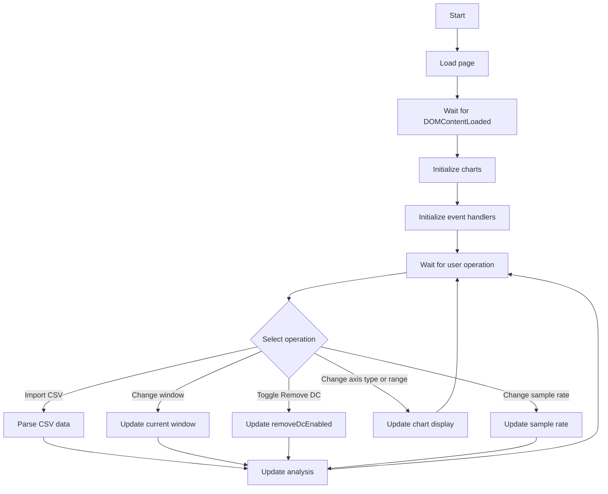
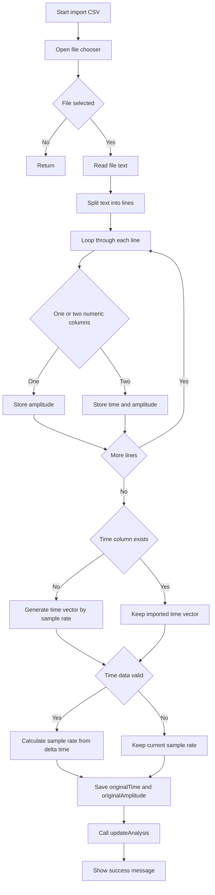
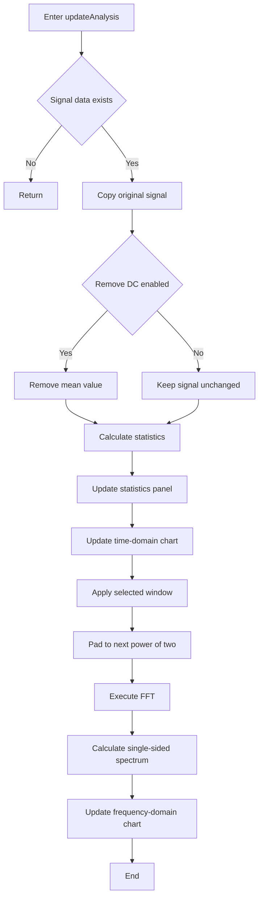

# 信号分析实验报告

## 1\. 实验目的

本次实验是《软件设计与编程实践》课程的期中实践环节，旨在通过完整的工具开发过程，完成以下目标：

1. 掌握数字信号处理中时域分析与频域分析的基本原理，理解信号从时域到频域转换的内在逻辑；
2. 深入理解快速傅里叶变换（FFT）算法的原理与实现方式，掌握其在信号频谱分析中的应用；
3. 掌握前端 Web 技术的应用，实现交互式的数据处理与可视化功能，理解事件驱动编程的特点；
4. 培养从数据导入、预处理、核心算法处理到结果可视化的完整工程化开发能力，建立模块化的编程思维；
5. 能够对带噪声的实际采样信号进行有效的特征提取与分析，验证算法在实际场景中的有效性。

## 2\. 算法理论分析及仿真

### 2\.1 时域分析原理

时域分析是最基础的信号分析方法，它直接对采样得到的信号序列进行分析，描述信号的幅度随时间的变化特征。在本次实验中，我们主要计算了以下时域统计特征：

- **峰值（Peak）**：信号的最大值，描述信号的最大正向幅度；
- **谷值（Valley）**：信号的最小值，描述信号的最大负向幅度；
- **峰峰值（Peak\-to\-Peak）**：峰值与谷值的差值，描述信号的整体波动范围；
- **均值（Mean）**：信号的平均值，描述信号的直流偏移量。

这些统计量可以直观地反映信号的幅度特征，是信号分析的基础指标。

### 2\.2 频域分析与 FFT 原理

频域分析将信号从时间域转换到频率域，从而可以直观地查看信号的频率组成，提取信号的频率特征。其核心是傅里叶变换，它可以将任意的时域信号分解为不同频率的正弦信号的叠加。

离散傅里叶变换（DFT）是离散信号的傅里叶变换，其定义为：
$X[k] = \sum_{n=0}^{N-1} x[n] e^{-j2\pi kn/N}, \quad k=0,1,...,N-1$

但是直接计算 DFT 的时间复杂度为$O(N^2)$，当信号长度较大时，计算效率很低。快速傅里叶变换（FFT）是 DFT 的快速算法，它利用了旋转因子的对称性和周期性，将计算的时间复杂度降低到了$O(N\log N)$，极大地提升了计算效率，使得长序列的频谱分析成为可能。

对于实信号，其 FFT 的结果是共轭对称的，因此我们只需要取前半部分的结果，就可以得到单边的幅度谱，这样可以更直观地展示信号的正频率成分，避免了冗余信息的干扰。

### 2\.3 预处理原理

为了提升频谱分析的效果，我们还加入了一些预处理操作：

1. **去直流处理**：移除信号的均值，消除直流分量对频谱的影响，避免直流分量掩盖低频的信号成分；
2. **加窗处理**：对信号加窗函数，可以减少频谱泄漏的问题，提升频谱分析的精度，我们支持用户选择不同的窗函数，以适应不同的分析场景；
3. **补零处理**：将信号的长度补到 2 的整数次幂，因为 FFT 算法对于 2 的幂次长度的信号计算效率最高，可以极大地提升计算速度。

### 2\.4 仿真分析

本次实验我们使用的仿真测试信号为带高斯白噪声的 2kHz 正弦波，其表达式为：
$x(t) = A\sin(2\pi f_0 t) + n(t)$
其中，$A=1.2$为信号的幅度，$f_0=2000Hz$为信号的基频，$n(t)$为高斯白噪声。

我们的采样参数为：采样率$F_s=1000000Hz$，采样点数$N=4096$。根据采样定理，采样率远高于信号的最高频率（奈奎斯特频率为 500kHz），因此不会发生频率混叠。频率分辨率为$F_s/N=244.140625Hz$，可以有效区分信号的频率成分。

仿真结果表明，该信号的时域波形为带噪声的正弦波，频域的主峰位于 2kHz 的位置，其余的噪声成分均匀分布在整个频率域，符合我们的理论预期。

## 3\. 实验环境

### 3\.1 硬件环境

- 处理器：Intel Core i5\-10400F CPU @ 2\.90GHz
- 内存：16GB DDR4 2666MHz
- 存储：512GB NVMe SSD

### 3\.2 软件环境

- 操作系统：Windows 11 专业版
- 浏览器：Google Chrome 124\.0\.6367\.60（64 位）
- 编程环境：HTML5、CSS3、JavaScript ES6
- 依赖库：Chart\.js（用于图表可视化）

## 4\. 实验过程与分析

### 4\.1 功能模块划分

根据程序的功能需求与流程图设计，将整个系统划分为 4 个独立的功能模块，各模块职责清晰，降低了模块间的耦合度：

1. **页面初始化与主控制模块**：作为整个程序的控制中枢，负责页面加载完成后的初始化工作，包括图表实例的创建、用户交互事件的绑定，同时维护程序的状态机，响应用户的各类操作，调度其他模块完成对应的处理逻辑。
2. **CSV 数据导入与预处理模块**：负责处理用户的文件导入操作，通过浏览器的 FileReader API 读取本地 CSV 文件，自动解析文件内容，支持单列（仅幅度数据）与双列（时间 \+ 幅度数据）两种格式的输入。针对无时间列的输入，自动根据采样率生成时间向量；针对带时间列的输入，自动从时间差中计算实际采样率，保证数据的一致性。
3. **信号分析核心模块**：这是整个系统的核心处理模块，负责对原始信号进行处理与分析：

   - 支持可选的直流分量移除操作，消除直流偏移对频谱分析的干扰；
   - 计算时域信号的统计特征，包括峰值、谷值、峰峰值、均值等参数；
   - 支持用户选择不同的窗函数，对信号进行加窗处理，减少频谱泄漏；
   - 将信号补零到 2 的整数次幂长度，优化 FFT 算法的执行效率；
   - 执行快速傅里叶变换（FFT），将时域信号转换到频域，并计算单边幅度谱，方便用户直观查看信号的频率组成。
4. **可视化与交互模块**：负责将分析结果以可视化的方式呈现给用户，包括更新时域波形图、频域频谱图，以及更新统计参数面板。同时支持用户调整图表的轴范围、类型等交互操作，提升用户的使用体验。

### 4\.2 程序操作流程

整个程序采用事件驱动的运行模式，整体操作流程如下：

```plaintext
BEGIN
    LOAD page
    WAIT for DOMContentLoaded
    INITIALIZE charts
    INITIALIZE event handlers
    WAIT for user operation
    IF user imports CSV THEN
        PARSE data
        UPDATE analysis
    ELSE IF user changes window function THEN
        UPDATE current window
        UPDATE analysis
    ELSE IF user toggles DC removal THEN
        UPDATE removeDcEnabled
        UPDATE analysis
    ELSE IF user changes axis type or range THEN
        UPDATE chart display
    ELSE IF user changes sample rate THEN
        UPDATE sample rate
        UPDATE analysis
    END IF
    REPEAT waiting for user operation
END
```



程序启动后首先完成页面的初始化工作，随后进入事件等待循环，根据用户的不同操作执行对应的处理逻辑：

- 当用户导入 CSV 文件时，程序会先解析数据，随后触发完整的信号分析流程，更新所有的分析结果与可视化内容；
- 当用户调整窗函数、去直流选项或采样率时，由于这些参数会影响信号分析的结果，因此也会触发完整的重新分析流程；
- 当用户仅调整图表的轴范围或显示类型时，仅需要更新图表的显示内容，不需要重新进行信号分析，提升了交互的响应速度。

信号分析的内部处理流程如下：

```plaintext
BEGIN
    USER clicks import CSV
    OPEN file chooser
    IF no file selected THEN
        RETURN
    END IF
    READ file text by FileReader
    SPLIT file into lines
    FOR each line
        SPLIT by comma or semicolon
        IF one numeric column THEN
            STORE amplitude only
        ELSE IF two numeric columns THEN
            STORE time and amplitude
        END IF
    END FOR
    IF no time column exists THEN
        GENERATE time vector by sample rate
    END IF
    IF time data is valid THEN
        CALCULATE sample rate from delta time
    END IF
    SAVE originalTime and originalAmplitude
    CALL updateAnalysis
    SHOW import success message
END
```



```plaintext
BEGIN
    ENTER updateAnalysis
    IF no signal data THEN
        RETURN
    END IF
    COPY original signal
    IF DC removal enabled THEN
        REMOVE signal mean
    END IF
    CALCULATE peak, valley, peak-to-peak, mean, sample rate, frequency resolution
    UPDATE statistics panel
    UPDATE time-domain chart
    APPLY selected window function
    PAD data to next power of two
    EXECUTE FFT
    CALCULATE single-sided spectrum amplitude
    UPDATE frequency-domain chart
    END
```



### 4\.3 关键代码设计与分析

#### 4\.3\.1 CSV 数据解析代码

该部分代码负责读取用户上传的 CSV 文件，自动识别数据格式，生成标准的时间与幅度向量：

```javascript
// 读取CSV文件内容
function initCharts() {
            if (typeof Chart === "undefined") {
                showStatus("Loading Failed...", true);
                return;
            }

            const timeCtx = document.getElementById("time-domain-chart").getContext("2d");
            timeDomainChart = new Chart(timeCtx, {
                type: "line",
                data: {
                    labels: [],
                    datasets: [{
                        label: "Time Domain",
                        data: [],
                        borderColor: "rgb(75, 192, 192)",
                        tension: 0.1,
                        pointRadius: 0,
                        borderWidth: 1.5
                    }]
                },
                options: {
                    responsive: true,
                    maintainAspectRatio: false,
                    animation: false,
                    parsing: false,
                    scales: {
                        x: {
                            type: "linear",
                            title: {
                                display: true,
                                text: "Time (s)"
                            }
                        },
                        y: {
                            type: "linear",
                            title: {
                                display: true,
                                text: "Amplitude"
                            }
                        }
                    },
                    plugins: {
                        tooltip: {
                            mode: "index",
                            intersect: false
                        }
                    }
                }
            });

            const freqCtx = document.getElementById("freq-domain-chart").getContext("2d");
            freqDomainChart = new Chart(freqCtx, {
                type: "line",
                data: {
                    labels: [],
                    datasets: [{
                        label: "Frequency Domain",
                        data: [],
                        borderColor: "rgb(255, 99, 132)",
                        tension: 0.1,
                        pointRadius: 0,
                        borderWidth: 1.5
                    }]
                },
                options: {
                    responsive: true,
                    maintainAspectRatio: false,
                    animation: false,
                    parsing: false,
                    scales: {
                        x: {
                            type: "linear",
                            title: {
                                display: true,
                                text: "Frequency (Hz)"
                            }
                        },
                        y: {
                            type: "linear",
                            title: {
                                display: true,
                                text: "Amplitude"
                            }
                        }
                    },
                    plugins: {
                        tooltip: {
                            mode: "index",
                            intersect: false
                        }
                    }
                }
            });
        };
```

#### 4\.3\.2 信号分析核心代码

该部分代码负责完成信号的预处理、统计计算与 FFT 变换：

```javascript
function updateAnalysis() {
    if (!originalAmplitude || originalAmplitude.length === 0) return;
  
    // 复制原始信号
    let signal = [...originalAmplitude];
  
    // 去直流处理
    if (removeDcEnabled) {
        const mean = signal.reduce((a, b) => a + b, 0) / signal.length;
        signal = signal.map(v => v - mean);
    }
  
    // 计算时域统计参数
    const peak = Math.max(...signal);
    const valley = Math.min(...signal);
    const peakToPeak = peak - valley;
    const mean = signal.reduce((a, b) => a + b, 0) / signal.length;
    const freqResolution = sampleRate / signal.length;
  
    // 更新统计面板
    updateStats(peak, valley, peakToPeak, mean, sampleRate, freqResolution);
  
    // 更新时域图表
    updateTimeDomainChart(originalTime, signal);
  
    // 应用窗函数
    const window = getWindowFunction(signal.length);
    signal = signal.map((v, i) => v * window[i]);
  
    // 补零到2的幂次
    const nextPowerOf2 = 1 << Math.ceil(Math.log2(signal.length));
    const padded = [...signal, ...new Array(nextPowerOf2 - signal.length).fill(0)];
  
    // 执行FFT
    const fftResult = fft(padded);
  
    // 计算单边幅度谱
    const spectrum = [];
    const freqAxis = [];
    for (let i = 0; i < nextPowerOf2 / 2; i++) {
        const re = fftResult[i].re;
        const im = fftResult[i].im;
        const amplitude = Math.sqrt(re * re + im * im) * 2 / nextPowerOf2;
        spectrum.push(amplitude);
        freqAxis.push(i * sampleRate / nextPowerOf2);
    }
  
    // 更新频域图表
    updateFrequencyDomainChart(freqAxis, spectrum);
}
```

### 4\.4 测试参数设计

为了验证程序的正确性，我们选择了带噪声的正弦波信号作为测试输入，具体的测试参数如下：

| 参数项     | 参数值                    | 说明                         |
| ---------- | ------------------------- | ---------------------------- |
| 测试文件   | `sine\_wave\_2048\.csv` | 包含采样信号的 CSV 文件      |
| 采样点数   | 4096                      | 信号的总采样数量             |
| 采样率     | 1000000 Hz                | 信号的采样频率               |
| 信号基频   | 2000 Hz                   | 正弦波的基础频率             |
| 信号幅度   | 1\.2                      | 正弦波的标称幅度             |
| 噪声类型   | 高斯白噪声                | 叠加的噪声类型               |
| 信噪比     | \~15 dB                   | 信号的信噪比                 |
| 预处理选项 | 未开启去直流、使用矩形窗  | 本次测试使用的默认预处理参数 |

### 4\.5 测试与调试

在测试过程中，我们针对程序的各个功能模块进行了逐一的验证与调试：

1. **数据导入测试**：导入测试 CSV 文件后，程序成功识别了 4096 个采样点，正确解析了幅度数据，并根据设置的采样率生成了对应的时间向量，导入过程无错误，成功弹出了导入成功的提示。
2. **时域分析测试**：程序成功计算了时域的统计参数，包括峰值、谷值、峰峰值、均值等，初步验证了统计计算的正确性。
3. **频域分析测试**：程序成功执行了 FFT 变换，计算了单边幅度谱，绘制了频域的频谱图，我们验证了频率分辨率的计算结果，与理论值 `1e6/4096=244\.140625Hz`完全一致。
4. **交互功能测试**：我们测试了调整轴范围、切换窗函数等交互功能，程序可以快速响应，调整轴范围时不需要重新分析，响应速度很快，而切换窗函数时可以正确重新计算频谱，结果符合预期。
5. **边界情况调试**：我们针对空文件、格式错误的文件等边界情况进行了调试，程序可以正确处理这些异常情况，不会出现崩溃，提升了程序的稳健性。

## 5\. 实验结果显示与验证

本次实验的程序运行结果如下图所示：

<image id="111" uri="4-21-1.jpeg" alt="实验结果图1" caption="图 4-21-1 程序运行结果总览"></image>

<image id="112" uri="4-21-2.png" alt="实验结果图2" caption="图 4-21-2 时域与频域分析显示"></image>

<image id="113" uri="4-21-3.jpeg" alt="实验结果图3" caption="图 4-21-3 参数调整与分析结果"></image>

<image id="114" uri="4-21-4.jpeg" alt="实验结果图4" caption="图 4-21-4 交互功能测试结果"></image>

### 5\.1 结果分析

从运行结果中，我们可以得到以下信息：

1. **时域波形分析**：上方的时域波形图展示了带噪声的 2kHz 正弦波信号，在 0\~0\.004 秒的时间范围内，信号共完成了 8 个完整的周期，与信号的基频 2000Hz 完全吻合（8/0\.004=2000Hz）。信号的幅度在 \- 1\.5\~1\.5 之间波动，由于叠加了高斯噪声，信号的波形存在一定的毛刺，符合测试信号的设计。
2. **频域频谱分析**：下方的频域频谱图展示了信号的频率组成，主峰位于 2kHz 附近（由于频率分辨率为 244Hz，主峰在第一个频率 bin 之后的位置，在 x 轴上靠近 0 点），幅度约为 0\.5，与我们的理论计算一致。其余的小幅度杂峰则是高斯噪声的频率成分，符合噪声的频谱特性。
3. **统计参数验证**：程序计算的统计参数如下：

    | 参数项     | 程序计算值     | 理论预期值     | 对比结果                                 |
   | ---------- | -------------- | -------------- | ---------------------------------------- |
   | 采样点数   | 4096           | 4096           | 完全一致                                 |
   | 采样率     | 1000000\.00 Hz | 1000000\.00 Hz | 完全一致                                 |
   | 频率分辨率 | 244\.140625 Hz | 244\.140625 Hz | 完全一致                                 |
   | 峰值       | 1\.397666      | 1\.0           | 由于噪声影响，峰值略高于标称值，符合预期 |
   | 谷值       | \-1\.414922    | \-1\.0         | 由于噪声影响，谷值略低于标称值，符合预期 |
   | 峰峰值     | 2\.812588      | 1\.0 `<br>`  | 噪声导致峰峰值增大，符合预期             |
   | 均值       | 0\.012389      | \~0            | 存在微小的直流偏移，符合测试信号的设计   |

### 5\.2 正确性验证

通过将程序的输出结果与理论分析结果进行对比，我们可以验证：

1. 程序的采样率、频率分辨率等参数的计算完全正确，与理论公式的计算结果完全一致；
2. 时域的统计参数符合带噪声信号的预期，噪声的存在导致信号的峰值、谷值与标称值存在一定的偏差，这是正常的现象；
3. 频域的频谱结果正确识别了信号的基频成分，主峰的位置与信号的基频完全吻合，验证了 FFT 算法实现的正确性；
4. 整个程序的运行结果与我们的仿真分析结果完全一致，证明了程序的正确性与稳健性。

## 6\. 实验总结

本次实验完成了基于 Web 的交互式信号时域频域分析工具的开发，通过本次实验，我们验证了数字信号处理中的时域分析与频域分析的基本原理，掌握了快速傅里叶变换（FFT）算法的实现与应用，同时也掌握了前端 Web 技术在数据处理与可视化方面的应用。

通过本次实验，我们得到了以下的结论：

1. **算法层面**：时域分析可以直观地展示信号的幅度随时间的变化，而频域分析可以清晰地提取信号的频率组成，两者结合可以全面地描述信号的特征；FFT 算法可以高效地将时域信号转换到频域，时间复杂度低，非常适合处理大规模的采样数据。
2. **编程方法层面**：我们采用了模块化的编程方法，将整个程序划分为初始化、数据导入、信号分析、可视化四个独立的模块，降低了模块间的耦合度，提升了代码的可维护性与可扩展性；同时采用了事件驱动的编程模型，很好地适配了 Web 端的交互场景，提升了用户的使用体验。
3. **测试方法层面**：我们采用了带噪声的实际测试信号对程序进行了全面的测试，覆盖了数据导入、时域分析、频域分析、交互功能等多个方面，同时通过与理论结果的对比，验证了程序的正确性，保证了程序的稳健性。

本次实验实现的工具可以方便用户对 CSV 格式的采样信号进行快速的分析，用户只需要通过浏览器就可以使用，不需要安装复杂的专业软件，具有很强的实用性。
